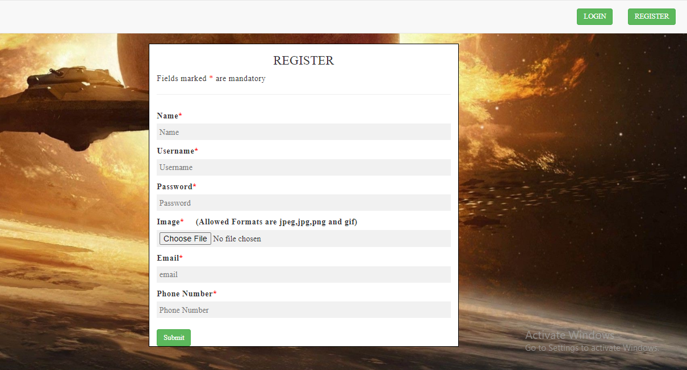
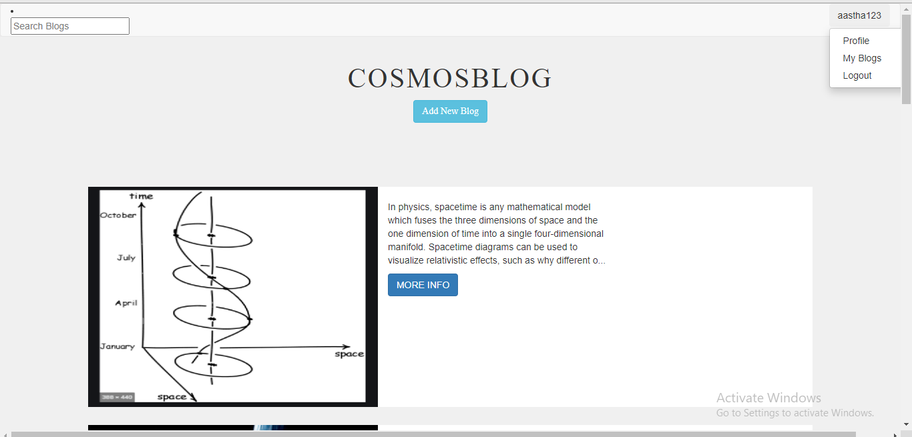

To see working head over to the link below.
[PROJECT LINK](https://powerful-bastion-56431.herokuapp.com/index)

Inform in case of errors by raising issues.

<h1 align="center" >CosmosBlog</h1>
<h3 align="center"> Blogging website for Space and Astronomy Enthusiasts</h3>

<hr>

<br>

[](http://forthebadge.com)
[](http://forthebadge.com)
[](https://forthebadge.com)

<br>

## About
• Users can Register or Login to begin space exploration by Writing or Editing their own blogs or Reading space blogs of others.
• Built using Nodejs, HTML and MongoDb the functionalities include Authentication system, Access control and Image uploading.

Website in development stage. More features and improvements will be added in the future.

## Demo
|           Index page                           |                Blog                       |
| -----------------------------------------------| ------------------------------------------|
|     |  |


|           Index page                      |                Blog                       |
| ------------------------------------------| ------------------------------------------|
|     | |

<br>
<br>

|           Login page                             |         Register page                                                 |
| -------------------------------------------------| ----------------------------------------------------------------------|
|  |                      |

<br>

## Tools used
* NodeJS, HTML
* Database - MongoDB Atlas

<br>

## Steps to run

### Database MongoDB
MongoDB Atlas is being used as database.

### Installing depencencies and running the app

* Fork the repository

* Clone the repository  
* Follow the steps as following in the bash

```sh
 cd Instances

 npm install

 npm start
```
* Now head over to http://localhost:3000/index to see it working.

<br>
